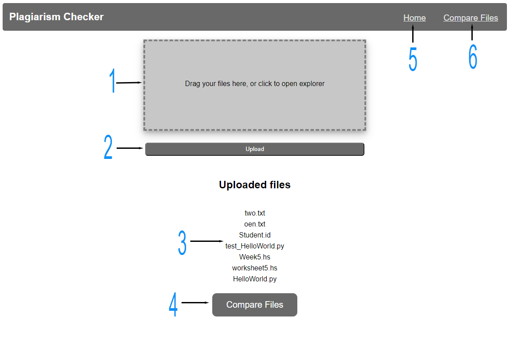
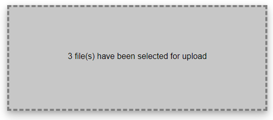
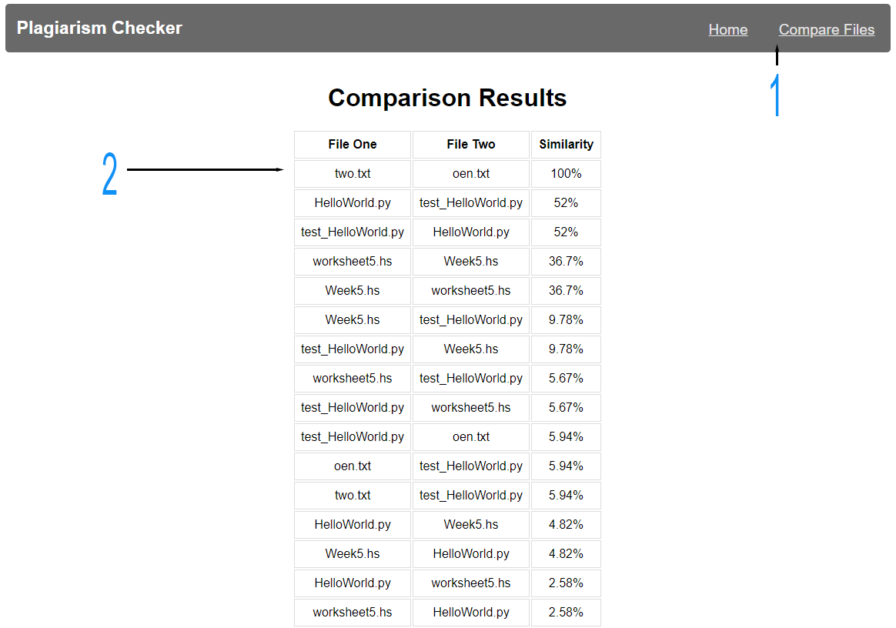

# UP851899 - Web Programming Coursework

This is my web coursework! Below I'll go over each of the pages and run through how my web app works.

## How to install

* npm i - installs the packages
* npm start - all that is needed, this will setup the database and create the /files directory for your file upload
* Application runs on **localhost:8800/**
* on loading **localhost:8080**, the index.html page will load and the app will be running

## Explanation

### Home Page

#### 1

Here is my drag and drop and file upload zone. Files can be dropped here for upload, or you can click the box to open up the file browser and search for the files that way. The text in the box will change showing how many items you have selected for upload or how many you have dropped into the page (as shown in the image below)

Unfortunately, dropping a group of files followed by a second group of files will not work - the way my program is designed means that it takes the most recent files to be dropped into the zone. This is also the same for selecting the files in the file browser, selecting one group of work and then going back to select another set before pressing the "upload" button will mean that the most recent set of work will be the ones ready to upload

#### 2

Once you have drag and dropped your files, or selected them for upload, you can press the "upload" button! The button will post the files selected onto my database and store them in a directory within the application files - if the directory has been deleted or no longer exists, then a new folder will be created. A randomly generated ID, the file name and file path will be stored onto the database

#### 3

Once your files have been uploaded and mapped to the database, a list of your uploaded files will show up on the homepage - this is designed to be used as a prompt for the user to show them that the files have been successfully uploaded, but to also see what files you already have uploaded! This list is updated on page refresh, so will always show once the page has loaded

#### 4

For usability, and general good looking-ness, I have added a "compare files" button below the list. This button will send you over to the comparison page, where a table will be presented on the comparison results... Nothing else to say about this, other than it has a nice transition if you hover your mouse over it

#### 5 & 6

Here is the website navigation, with links to the homepage and to the compare files page. Like the button talked about in 5, the "Compare Files" nav button will take you to the comparison page

### Comparison Page

{ width=50% }

### 1

Here we have the same navigation as the home page for website continuity, buttons perform the same tasks - home will take you back to the home page where you are able to upload further files

#### 2

Here is the results table for the file comparison. The table is sorted high-to-low to show the user which files have a considerable amount of plagiarism

## File structure

<image align="left" src="images/structure.png">

Here is the file structure for my project.

the "files" directory, as well as the "fileDB.sqlite" file will be automatically created when the program starts. The "files" folder will only be created if it does not exist, it wont replace the folder. The "fileDB.sqlite" is created and configured by the fileStorage.js script which will initialize the database using the "migrations/001-inital.sql" file, where my database config is held (creation of tables). SQLite was the best option for this season, be easy to integrate into my program and being able to run easily locally (unlike PSQL which I found to be a pain with my Software Engineering CW).

Everything the user sees is within the "web_pages" folder. This contains the two HTML pages and the styling for my web app. Styling is kept to a single stylesheet for easy management and control over all HTML files (for example, if a user wants, it would need one edit to change the global font to comic sans)

The "modules" folder contains the js script "compare.js", this is responsible for the comparison of files using string-comparison.

To reset the program, the "files" folder and "fileDB.sqlite" can simply be deleted